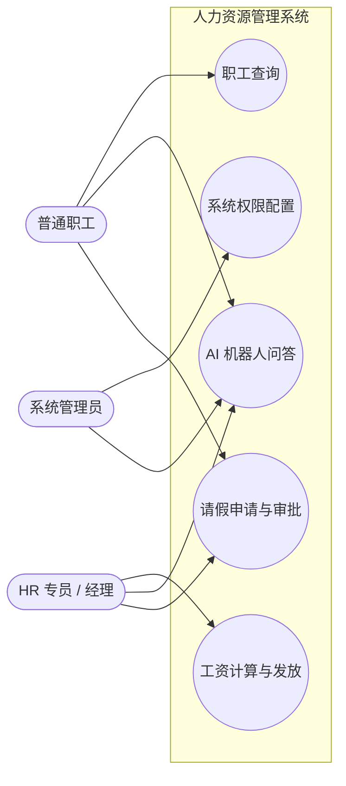
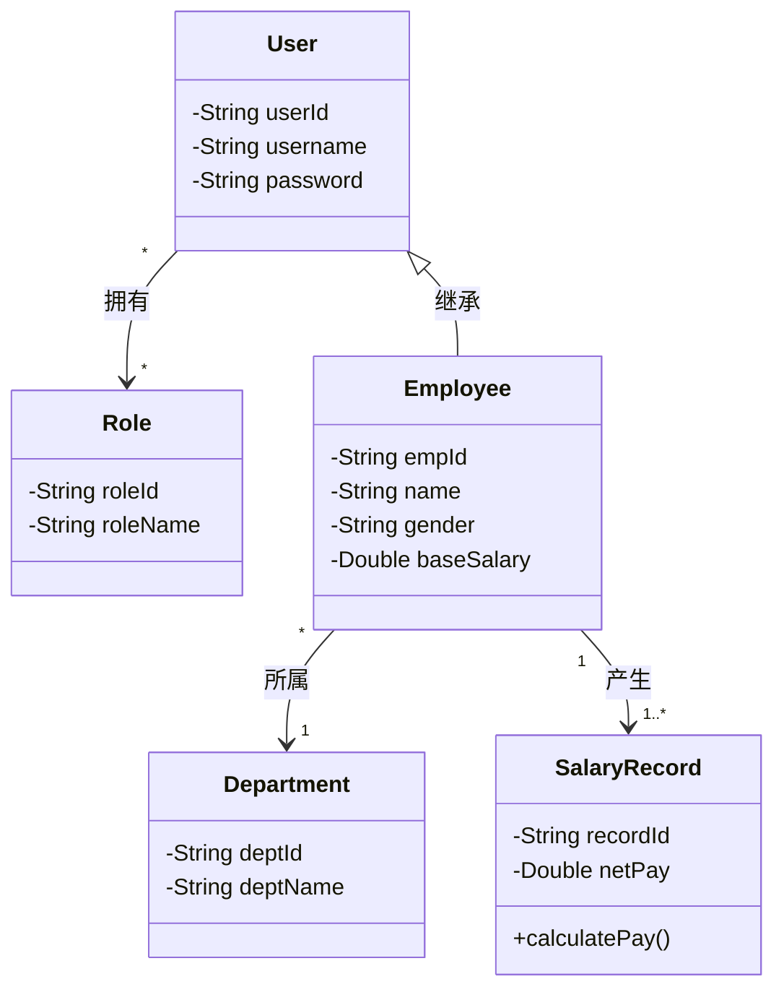
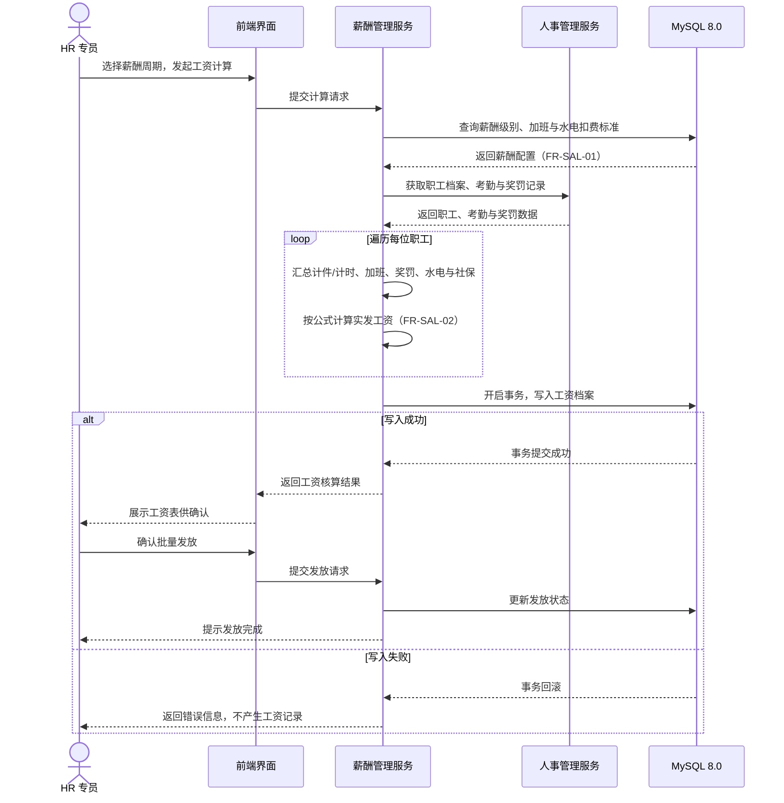
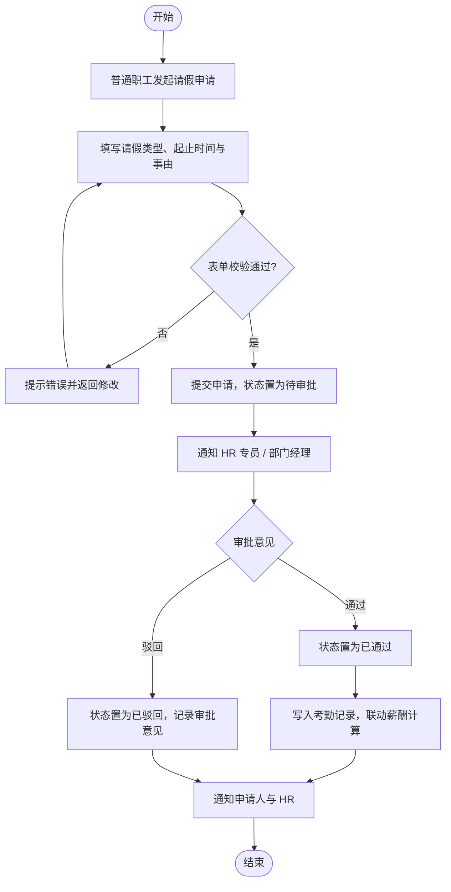

# 人力资源管理系统（HRMS）需求规格说明书 (SRS)

| 项目     | 内容                                                                  |
| -------- | --------------------------------------------------------------------- |
| 项目名称 | 人力资源管理系统（Enterprise Human Resource Management System，HRMS） |
| 课程名称 | 软件综合实践（j3231703）                                              |
| 文档版本 | V1.1                                                                  |
| 撰写日期 | 2026 年 9 月                                                          |
| 撰写人   | 王坤尧 |
| 技术选型 | 网络版（B/S 架构）\| Django 5.2 LTS + MySQL 8.0 \| AI 应答机器人集成       |

---

## 1. 引言 (Introduction)

### 1.1 编写目的

本文档定义人力资源管理系统（HRMS）的功能需求、数据需求与非功能需求，作为后续设计、编码、测试与课程验收的共同基线，并为需求变更提供追溯依据。

### 1.2 项目背景与目标

* **背景**：本项目为《软件综合实践》课程实训课题。企业在人力资源管理中面临员工信息分散、薪酬计算繁琐、培训跟踪困难等痛点。
* **目标**：开发一套高效、安全、可扩展的**网络版** HRMS 系统，覆盖企业人事、薪酬、培训、报表统计等核心业务，实现人力资源管理的数字化与自动化。

### 1.3 术语与缩写

| 缩写 / 术语 | 全称                                             | 说明                                 |
| ----------- | ------------------------------------------------ | ------------------------------------ |
| SRS         | Software Requirements Specification              | 需求规格说明书（本文档）             |
| HRMS        | Human Resource Management System                 | 人力资源管理系统                     |
| B/S         | Browser/Server                                   | 浏览器—服务器架构，网络版部署       |
| C/S         | Client/Server                                    | 客户端—服务器架构                   |
| RBAC        | Role-Based Access Control                        | 基于角色的访问控制                   |
| CRUD        | Create / Read / Update / Delete                  | 增、删、改、查                       |
| DAL         | Data Access Layer                                | 数据访问层                           |
| ACID        | Atomicity / Consistency / Isolation / Durability | 数据库事务四大特性                   |
| Django      | Django 5.2 LTS | Python Web 框架（本项目后端）                     |
| MySQL       | MySQL 8.0                                   | 关系型数据库（本项目运行时库）                     |
| GUID        | Globally Unique Identifier                       | 全局唯一标识符                       |
| UML         | Unified Modeling Language                        | 统一建模语言                         |
| FR          | Functional Requirement                           | 功能需求（编号`FR-<模块>-<序号>`） |
| UC          | Use Case                                         | 用例（编号`UC-<序号>`）            |

## 2. 可行性分析 (Feasibility Analysis)

在需求确立前，从四个维度进行可行性评估：

| 评估维度                           | 分析结论       | 详细说明                                                                                                                                      |
| ---------------------------------- | -------------- | --------------------------------------------------------------------------------------------------------------------------------------------- |
| **技术可行性 (Technical)**   | **可行** | 采用成熟的 B/S 架构，后端 Django 5.2 LTS（Python 3.12），前端 Django 模板 + Bootstrap 5，数据库 MySQL 8.0，技术栈稳定且生态完备。 |
| **经济可行性 (Economic)**    | **可行** | 使用开源技术栈与免费/社区版数据库，开发与部署成本极低，符合课程实验条件。                                                                     |
| **实践可行性 (Operational)** | **可行** | 课题业务逻辑明确，组员职责清晰，10 天周期配合按功能簇推进的迭代方式，可确保覆盖课程清单全部 37 项功能条目。                                                         |
| **法律与合规性 (Legal)**     | **可行** | 自研系统，数据存储于本地 MySQL 数据库，符合数据安全与隐私保护要求。                                                                            |

---

## 3. 系统总体描述 (Overall Description)

### 3.1 总体架构

系统采用标准的网络版分层架构（B/S 架构，非单机部署）：

| 层次                             | 职责                                       | 主要技术 / 组件                    |
| -------------------------------- | ------------------------------------------ | ---------------------------------- |
| 表现层 (UI Layer)                | Web 前端，提供响应式交互界面               | Django 模板 + Bootstrap 5（服务端渲染）+ ECharts 5（图表）         |
| 业务逻辑层 (Business Layer)      | 业务规则、权限控制及核心算法（如薪酬计算） | Django 5.2 LTS（Python 3.12）          |
| 数据访问层 (DAL)                 | 完成数据的 CRUD 操作与事务管理             | Django ORM + MySQL 8.0 |
| 扩展服务层 (External / AI Layer) | 集成智能应答机器人接口，提升交互体验       | 规则引擎（意图槽位 + SQL 模板）+ DeepSeek API（可选）          |

> **架构选型说明：为何采用服务端渲染而非前后端分离**
>
> 1. 本系统以表单填报与数据展示为主，交互复杂度低，Django 模板 + 通用视图（ListView / CreateView / UpdateView / DeleteView）可覆盖绝大多数页面。
> 2. 前后端分离会使**每一项功能都需在后端 API 层与前端页面层各实现一遍**，并额外引入 CORS、Token 鉴权、状态管理、前后端校验同步等成本，与 10 个教学日的交付周期不匹配。
> 3. 报表统计（FR-RPT-01 ~ FR-RPT-03）所需的图表交互，通过 **ECharts 局部增强**实现：后端以 `JsonResponse` 提供聚合数据接口，前端异步渲染，无需引入完整 SPA 框架。
> 4. 「用户与菜单管理」「数据字典」等后台类功能由 **Django Admin** 直接承载，进一步压缩开发量。

### 3.2 角色与用户特征 (User Classes)

| 角色           | 主要职责                               | 典型用例                | 关联需求                                                 |
| -------------- | -------------------------------------- | ----------------------- | -------------------------------------------------------- |
| 系统管理员     | 组织 / 字典设置、用户与权限管理        | 系统权限配置            | FR-SYS-01 ~ FR-SYS-03                                     |
| HR 专员 / 经理 | 人事 / 薪酬 / 培训操作、报表统计与打印 | 工资计算与发放          | FR-PER-01 ~ FR-PER-04、FR-SAL-01 ~ FR-SAL-03、FR-TRN-01 ~ FR-TRN-02、FR-RPT-01 ~ FR-RPT-03 |
| 普通职工       | 查询个人档案 / 工资、提交请假、AI 问答 | 职工查询、AI 机器人问答 | FR-QRY-01、FR-PER-03（发起）、FR-AI-01~02                |

### 3.3 运行环境与部署

| 项目            | 要求                                                        |
| --------------- | ----------------------------------------------------------- |
| 部署形态        | 网络版（B/S），支持多客户端网络访问，**不允许单机版** |
| 数据库          | MySQL 8.0（utf8mb4 字符集 / InnoDB 引擎）                              |
| 客户端          | 主流浏览器（Chrome / Edge），免安装                         |
| 服务端环境      | Windows 10 + Python 3.12 + Django 5.2 LTS + MySQL 8.0                      |
| 硬件环境        | CPU Intel Core i7 9700K；GPU NVIDIA GTX 1050                |
| 实践场地 / 周期 | 厚为楼 701ab；2026.09.28 — 2026.10.15（10 天）             |
| 验收时间        | 2026 年 10 月 15 日                                         |

### 3.4 约束与假设

| 编号 | 类型 | 内容                                                                        |
| ---- | ---- | --------------------------------------------------------------------------- |
| C-01 | 约束 | 必须为网络版（C/S 或 B/S），不得交付单机版                                  |
| C-02 | 约束 | 数据库选用 MySQL 8.0（课程建议使用国产数据库，本项目基于 Django 生态兼容性与交付周期考量选用 MySQL，理由见 5.2）                        |
| C-03 | 约束 | 10 天实训周期内须完成开发，功能覆盖课程清单 37 项功能条目的 100%                           |
| C-04 | 约束 | UML 模型须由建模工具（Visual Paradigm CE）生成 Python 代码框架（Entity & Interface），并接受检查 |
| C-05 | 约束 | 遵守课程安全与保密规定                                                      |
| A-01 | 假设 | 由教师 / 评审方提供验收环境与演示硬件                                       |
| A-02 | 假设 | 系统面向小型企业场景，支持多用户同时在线                                     |

---

## 4. 详细功能需求 (Functional Requirements)

系统包含 **6 大核心业务模块** 与 **1 个加分项模块（智能应答机器人）**，共 19 项功能需求，完整覆盖课程课题清单的 37 项功能条目。需求编号统一采用 `FR-<模块缩写>-<序号>` 规则，与章节编号解耦，便于后续增删调整与追溯。

### 4.1 模块 1：人事管理 (Personnel Management)

| 需求编号  | 需求名称         | 需求描述                                       | 优先级 |
| --------- | ---------------- | ---------------------------------------------- | ------ |
| FR-PER-01 | 职工档案管理     | 职工增删改查；调动记录管理；证书资质录入与导出 | 高     |
| FR-PER-02 | 实习生与社保管理 | 实习生转正申请；员工社保基数与缴纳记录维护     | 高     |
| FR-PER-03 | 考勤与请假       | 请假申请、审批流转、奖罚事件登记               | 高     |
| FR-PER-04 | 员工关怀         | 职工生日自动提醒与统计                         | 中     |

### 4.2 模块 2：培训管理 (Training Management)

| 需求编号  | 需求名称       | 需求描述                         | 优先级 |
| --------- | -------------- | -------------------------------- | ------ |
| FR-TRN-01 | 课程与方案管理 | 建立培训课程库；制定内部培训计划 | 中     |
| FR-TRN-02 | 专项培训       | 一线工人技能培训考核与成绩登记   | 中     |

### 4.3 模块 3：薪酬管理 (Salary Management)

| 需求编号  | 需求名称       | 需求描述                                                                                     | 优先级 |
| --------- | -------------- | -------------------------------------------------------------------------------------------- | ------ |
| FR-SAL-01 | 薪酬体系配置   | 设定薪酬级别、加班补贴标准、水电费扣除标准                                                   | 高     |
| FR-SAL-02 | 工资计算与发放 | 支持**计件工资**与**计时工资**混合计算；生成工资档案；支持批量发放与历史薪酬查询 | 高 |
| FR-SAL-03 | 加班与水电费登记 | 加班时长与事由登记；宿舍水电费抄表与扣费登记，作为工资扣减项的数据来源 | 高     |

工资计算公式如下：

$$
\text{实发工资} = \text{基本工资} + \text{计件/计时工资} + \text{加班费} + \text{奖罚净额} - \text{水电扣费} - \text{社保自负部分}
$$

其中：

$$
\text{奖罚净额} = \sum \text{奖励金额} - \sum \text{处罚金额} \quad (\text{可为负})
$$

各项数据来源与计算口径如下：

| 公式项 | 数据来源 | 计算说明 |
| --- | --- | --- |
| 基本工资 | 薪酬体系配置（FR-SAL-01） | 取员工所关联薪酬级别的基本工资 |
| 计件/计时工资 | 计件产量登记（FR-SAL-02） | 汇总该员工本周期产量记录的金额：计件 = 数量 × 单价，计时 = 工时 × 时薪 |
| 加班费 | 加班登记（FR-SAL-03）+ 薪酬标准 | 时薪 = 基本工资 ÷ 月标准工时；每条加班费 = 加班时长 × 时薪 × 对应倍率（工作日 1.5 / 休息日 2.0 / 法定节假日 3.0） |
| 奖罚净额 | 奖罚登记（FR-PER-03） | 本周期奖励合计减去处罚合计，允许为负 |
| 水电扣费 | 水电费登记（FR-SAL-03） | 取该员工本周期的合计扣费金额 |
| 社保自负部分 | 社保缴纳记录（FR-PER-02） | 优先取该周期社保记录的个人承担合计；无记录时按「社保比例 × 基本工资」估算 |

> **核算规则**：同一员工同一薪酬周期只生成一条工资档案；重复核算时更新而不再新增。「待发放」状态可重新核算，「已发放」状态锁定不再变更。批量核算必须整体事务化，任一条失败则全批回滚（对应 SRS 5.3）。

### 4.4 模块 4：公共查询 (Public Query)

| 需求编号  | 需求名称       | 需求描述                                     | 优先级 |
| --------- | -------------- | -------------------------------------------- | ------ |
| FR-QRY-01 | 多维检索       | 支持按部门、职位、工龄、学历等条件的复合查询 | 中     |
| FR-QRY-02 | 通知套红与打印 | 生成人事变动通知单，支持 PDF 导出或打印      | 中     |

### 4.5 模块 5：报表与数据统计 (Analytics & Reporting)

提供可视化图表（柱状图、饼图、折线图）：

| 需求编号  | 需求名称 | 需求描述                                            | 优先级 |
| --------- | -------- | --------------------------------------------------- | ------ |
| FR-RPT-01 | 结构统计 | 性别比例、年龄段分布、学历构成、工龄分布（柱状图 / 饼图）     | 中     |
| FR-RPT-02 | 动态分析 | 离职率统计；年度 / 季度人员新增与流动趋势（折线图） | 中 |
| FR-RPT-03 | 人员流动统计 | 在职人员总数统计；新增人员统计；辞职人员统计 | 中     |

### 4.6 模块 6：系统设置与安全 (System Settings)

| 需求编号  | 需求名称 | 需求描述                                                         | 优先级 |
| --------- | -------- | ---------------------------------------------------------------- | ------ |
| FR-SYS-01 | 权限控制 | 基于 RBAC（基于角色的访问控制）模型，分配菜单与操作权限          | 高     |
| FR-SYS-02 | 基础数据 | 组织机构树形管理；数据字典（政治面貌、岗位级别等）；社保比例配置 | 高 |
| FR-SYS-03 | 用户与菜单管理 | 用户账号增删改查与启停；导航菜单配置与角色可见性绑定 | 高     |

### 4.7 加分项：HR 智能应答机器人 (AI HR Assistant)

| 需求编号 | 需求名称      | 需求描述                                                   | 优先级 |
| -------- | ------------- | ---------------------------------------------------------- | ------ |
| FR-AI-01 | 智能 FAQ 问答 | 员工可向机器人询问社保缴费比例、请假流程、薪酬发放日等问题 | 加分项 |
| FR-AI-02 | 个人数据查询  | 通过自然语言交互查询剩余年假、本月应发工资等               | 加分项 |

> **说明**：优先级判定原则为**核心业务为高、其余为中、加分项单列**；按本项目目标，验收时功能覆盖率达到 100%（课程清单 37 项功能条目全部实现）；19 项 FR 与 37 项原文条目的逐条对应关系见 8.1。

---

## 5. 数据需求 (Data Requirements)

### 5.1 核心实体

| 实体                  | 说明         | 主要属性                             | 关联需求  |
| --------------------- | ------------ | ------------------------------------ | --------- |
| User 用户             | 系统登录账号 | userId、username、password           | FR-SYS-01 |
| Role 角色             | 权限集合     | roleId、roleName                     | FR-SYS-01 |
| Employee 员工         | 职工档案     | empId、name、gender、baseSalary      | FR-PER-01 |
| Department 部门       | 组织机构节点 | deptId、deptName                     | FR-SYS-02 |
| SalaryRecord 工资记录 | 薪酬发放档案 | recordId、netPay、`calculatePay()` | FR-SAL-02 |

实体关系：`User` 与 `Role` 为**多对多**（一个用户可有多个角色，一个角色可授予多个用户）；`Employee` 继承 `User`；`Employee` 与 `Department` 为**多对 1**（一个部门有多名员工）；`Employee` 与 `SalaryRecord` 为 1 对多。

> 其余实体（培训课程、请假、证书、通知单等）随各模块详细设计补充。

### 5.2 数据库设计与选型说明

1. **选型说明**：课程建议采用国产数据库（达梦 / 人大金仓），本项目选用 **MySQL 8.0**，理由为：Django 官方仅内置 PostgreSQL / MySQL / SQLite / Oracle 四种数据库后端，对 MySQL 为一等公民支持；国产数据库缺少可用的 Django ORM 方言层，自行适配将挤占本已紧张的功能开发周期。
2. **设计约定**：统一使用 InnoDB 引擎与 `utf8mb4` 字符集；主键采用自增 `BIGINT`，业务标识使用唯一编码；表结构与查询遵循标准 SQL，避免强方言绑定，保留后续迁移至国产数据库的可能性。
3. **索引策略**：在工号、姓名、部门、薪酬周期等高频查询字段上建立索引；报表统计使用聚合查询，避免 N+1 查询。
4. **可移植性**：以标准 DDL 脚本交付表结构，并附测试数据 DML 脚本（对应交付物 D-03）。

### 5.3 数据完整性与事务

1. 通过外键约束保证引用完整性。
2. 薪酬计算等关键业务必须使用数据库事务处理，满足 ACID 特性。

---

## 6. 系统 UML 建模设计 (UML Modeling Design)

> **注**：根据课程要求，建模需在 UML 工具中完成后直接**生成对应语言的代码框架**（**Python Entity & Interface**），并接受检查。

### 6.1 用例图 (Use Case Diagram)

主要用例与参与者、功能需求的对应关系如下：

| 用例编号 | 用例名称       | 主要参与者        | 对应功能需求         |
| -------- | -------------- | ----------------- | -------------------- |
| UC-01    | 职工查询       | 普通职工、HR 专员 | FR-QRY-01、FR-PER-01 |
| UC-02    | 工资计算与发放 | HR 专员           | FR-SAL-01、FR-SAL-02 |
| UC-03    | 系统权限配置   | 系统管理员        | FR-SYS-01            |
| UC-04    | AI 机器人问答  | 全部角色          | FR-AI-01、FR-AI-02 |
| UC-05    | 请假申请与审批 | 普通职工、HR 专员 | FR-PER-03   |

### 6.2 类图 (Class Diagram)

### 6.3 时序图 (Sequence Diagram)

针对 UC-02「工资计算与发放」，描述一次完整薪酬核算与发放的交互时序（对应 FR-SAL-01、FR-SAL-02）：

### 6.4 活动图 (Activity Diagram)

针对 FR-PER-03「请假申请与审批流转」的业务过程建模：

### 6.5 UML 图完成情况

| 图种          | 状态   | 覆盖需求 / 用例             |
| ------------- | ------ | --------------------------- |
| 用例图（6.1） | 已完成 | UC-01 ~ UC-05               |
| 类图（6.2）   | 已完成 | 5.1 核心实体                |
| 时序图（6.3） | 已完成 | UC-02、FR-SAL-01、FR-SAL-02 |
| 活动图（6.4） | 已完成 | UC-05、FR-PER-03            |

> 4 类 UML 图需在 **Visual Paradigm Community Edition** 中建完后导出 **Python 代码框架**（Entity & Interface）并接受检查。
> 活动图对应的「请假申请与审批」已立为 **UC-05** 并入用例图，两图完全对应。

---

## 7. 非功能需求 (Non-Functional Requirements)

### 7.1 性能与并发

1. **响应时间（设计目标）**：在本机单机部署、数据量 $\le$ 1 万条的条件下，常规查询操作响应时间 $\le 1.5\text{s}$；复杂报表导出响应时间 $\le 3\text{s}$。
2. **多用户访问**：支持多用户同时在线，满足小型企业日常考勤与查询使用。
3. **测量方法**：指标定义、取样规则、记录表与通过标准详见《HRMS 系统测试预案》第 3 章。

### 7.2 界面与易用性

1. **Web 响应式界面**：主次清晰，菜单支持根据用户角色动态加载。
2. **导航与提示**：具备数据录入校验机制（如身份证号、手机号格式校验），错误提示友好。

### 7.3 安全与合规

1. **认证与授权**：基于 RBAC 的访问控制（见 FR-SYS-01），未登录用户不得访问业务功能。
2. **数据存储**：数据存放于本地 MySQL 数据库，账号密码经哈希存储，符合数据安全与隐私保护要求。
3. **数据一致性**：关键业务事务化处理（见 5.3）。

---

## 8. 需求追溯与验收 (Traceability & Acceptance)

### 8.1 需求追溯矩阵

| 需求模块       | 功能需求              | 对应用例      | 交付物           | 课程验收要点                                             |
| -------------- | --------------------- | ------------- | ---------------- | -------------------------------------------------------- |
| 人事管理       | FR-PER-01 ~ FR-PER-04 | UC-01         | D-01、D-05       | 覆盖 100%（37 项）；10 月 15 日验收                      |
| 培训管理       | FR-TRN-01 ~ FR-TRN-02 | —            | D-01、D-05       | 覆盖 100%（37 项）                                       |
| 薪酬管理       | FR-SAL-01 ~ FR-SAL-03 | UC-02         | D-01、D-03、D-05 | 加班/水电费登记完整，事务保证 ACID 一致性                           |
| 公共查询       | FR-QRY-01 ~ FR-QRY-02 | UC-01         | D-01             | —                                                       |
| 报表统计       | FR-RPT-01 ~ FR-RPT-03 | —            | D-01、D-05       | —                                                       |
| 系统设置与安全 | FR-SYS-01 ~ FR-SYS-03 | UC-03         | D-01、D-03       | RBAC 权限模型                                            |
| AI 应答机器人  | FR-AI-01 ~ FR-AI-02   | UC-04         | D-04             | 加分项                                                   |
| UML 建模       | 见第 6 章             | UC-01 ~ UC-05 | D-02             | 用例图 / 类图 / 时序图 / 活动图共 4 张，并由模型生成 Python 代码框架 |

### 8.2 交付物清单 (Deliverables Checklist)

根据课程考核要求，本次开发成果验收对比如下：

| 交付编号 | 交付物名称           | 规格标准                                      | 课程要求对应项        |
| -------- | -------------------- | --------------------------------------------- | --------------------- |
| D-01     | 软件系统源码         | 覆盖 100%（37 项）需求，支持网络访问（非单机） | 验收时间：10 月 15 日 |
| D-02     | UML 模型与代码       | 提供用例图、类图、时序图、活动图共 4 图（含 UC-05），并导出 Python 代码框架   | 教授要点第 4 项       |
| D-03     | MySQL 8.0 SQL 脚本 | 包含 DDL 表结构建表语句与测试数据 DML         | 数据库要求        |
| D-04     | AI 应答模块          | 具备文本交互功能，支持离线规则模式与云 API 增强                        | 加分项                |
| D-05     | 综合实践报告         | 个人撰写，包含 10 项完整结构及测试结果        | 占总评 35%            |
| D-06     | 系统测试预案与记录   | 性能指标定义、≥45 条测试用例、缺陷记录与结果汇总 | 报告第 7 章测试与部署 |

---

## 附录 A 修订记录

| 版本 | 日期       | 修订内容 | 修订人 |
| ---- | ---------- | -------- | ------ |
| V1.1 | 2026-09-28 | 按软件工程规范重构章节结构；补充术语表、运行环境、约束与假设、数据需求、需求追溯矩阵；补充时序图（工资计算与发放）与活动图（请假审批）；明确优先级判定原则为「核心业务为高」；补齐 UC-05 使用例图与活动图闭环；技术栈定为 Django 5.2 LTS + MySQL 8.0（Django 6.x 要求 MySQL 8.4+，本机 MySQL 8.0.19 故选用 5.2 LTS）；功能需求由 16 项扩充至 19 项以覆盖课程清单全部 37 项；修正类图基数（User-Role 多对多、Employee-Department 多对 1）；性能指标明确为设计目标；统一署名 | 王坤尧 |
| V1.2 | 2026-09-28 | 工资核算公式增加「奖罚净额」项，使 FR-PER-03 登记的奖励与处罚参与实发工资计算；补充各项数据来源与计算口径说明；补充工资核算幂等性与发放锁定规则；同步修订时序图与测试预案 | 王坤尧 |
