# 人力资源管理系统（HRMS）需求规格说明书 (SRS)

| 项目     | 内容                                                                  |
| -------- | --------------------------------------------------------------------- |
| 项目名称 | 人力资源管理系统（Enterprise Human Resource Management System，HRMS） |
| 课程名称 | 软件综合实践（j3231703）                                              |
| 文档版本 | V1.1                                                                  |
| 撰写日期 | 2026 年 9 月                                                          |
| 撰写人   | 王坤尧                                                                |
| 技术选型 | 网络版（B/S 架构）\| Django 5.2 LTS + MySQL 8.0 \| AI 应答机器人集成  |

---

## 1. 引言 (Introduction)

### 1.1 编写目的

本文档定义人力资源管理系统（HRMS）的功能需求、数据需求与非功能需求，作为后续设计、编码、测试与课程验收的共同基线，并为需求变更提供追溯依据。

### 1.2 项目背景与目标

* **背景**：本项目为《软件综合实践》课程实训课题。企业在人力资源管理中面临员工信息分散、薪酬计算繁琐、培训跟踪困难等痛点。
* **目标**：开发一套高效、安全、可扩展的**网络版** HRMS 系统，覆盖企业人事、薪酬、培训、报表统计等核心业务，实现人力资源管理的数字化与自动化。

### 1.3 术语与缩写

| 缩写 / 术语 | 全称                                             | 说明                                                                  |
| ----------- | ------------------------------------------------ | --------------------------------------------------------------------- |
| SRS         | Software Requirements Specification              | 需求规格说明书（本文档）                                              |
| HRMS        | Human Resource Management System                 | 人力资源管理系统                                                      |
| B/S         | Browser/Server                                   | 浏览器—服务器架构，网络版部署                                        |
| C/S         | Client/Server                                    | 客户端—服务器架构                                                    |
| RBAC        | Role-Based Access Control                        | 基于角色的访问控制                                                    |
| CRUD        | Create / Read / Update / Delete                  | 增、删、改、查                                                        |
| DAL         | Data Access Layer                                | 数据访问层                                                            |
| ACID        | Atomicity / Consistency / Isolation / Durability | 数据库事务四大特性                                                    |
| ORM         | Object-Relational Mapping                        | 对象关系映射，以 Python 对象操作数据库表                              |
| WSGI        | Web Server Gateway Interface                     | Web 服务器与应用之间的标准接口，Django 应用经由 WSGI 容器对外提供服务 |
| HTTP        | HyperText Transfer Protocol                      | 超文本传输协议，浏览器与服务器之间的通信协议                          |
| Django      | Django 5.2 LTS                                   | Python Web 框架（本项目后端）                                         |
| MySQL       | MySQL 8.0                                        | 关系型数据库（本项目运行时库）                                        |
| ECharts     | Apache ECharts 5                                 | 开源可视化图表库（报表图表渲染）                                      |
| GUID        | Globally Unique Identifier                       | 全局唯一标识符                                                        |
| UML         | Unified Modeling Language                        | 统一建模语言                                                          |
| FR          | Functional Requirement                           | 功能需求（编号`FR-<模块>-<序号>`）                                  |
| UC          | Use Case                                         | 用例（编号`UC-<序号>`）                                             |

## 2. 可行性分析 (Feasibility Analysis)

在需求确立前，从四个维度进行可行性评估：

| 评估维度                           | 分析结论       | 详细说明                                                                                                                          |
| ---------------------------------- | -------------- | --------------------------------------------------------------------------------------------------------------------------------- |
| **技术可行性 (Technical)**   | **可行** | 采用成熟的 B/S 架构，后端 Django 5.2 LTS（Python 3.12），前端 Django 模板 + Bootstrap 5，数据库 MySQL 8.0，技术栈稳定且生态完备。 |
| **经济可行性 (Economic)**    | **可行** | 使用开源技术栈与免费/社区版数据库，开发与部署成本极低，符合课程实验条件。                                                         |
| **实践可行性 (Operational)** | **可行** | 课题业务逻辑明确，组员职责清晰，10 天周期配合按功能簇推进的迭代方式，可确保覆盖课程清单全部 37 项功能条目。                       |
| **法律与合规性 (Legal)**     | **可行** | 自研系统，数据存储于本地 MySQL 数据库，符合数据安全与隐私保护要求。                                                               |

---

## 3. 系统总体描述 (Overall Description)

### 3.1 总体架构

系统采用标准的网络版分层架构（B/S 架构，非单机部署）：

| 层次                             | 职责                                       | 主要技术 / 组件                                            |
| -------------------------------- | ------------------------------------------ | ---------------------------------------------------------- |
| 表现层 (UI Layer)                | Web 前端，提供响应式交互界面               | Django 模板 + Bootstrap 5（服务端渲染）+ ECharts 5（图表） |
| 业务逻辑层 (Business Layer)      | 业务规则、权限控制及核心算法（如薪酬计算） | Django 5.2 LTS（Python 3.12）+ WSGI 容器                   |
| 数据访问层 (DAL)                 | 完成数据的 CRUD 操作与事务管理             | Django ORM + MySQL 8.0                                     |
| 扩展服务层 (External / AI Layer) | 集成智能应答机器人接口，提升交互体验       | 规则引擎（意图槽位 + SQL 模板）+ DeepSeek API（可选）      |

> **架构选型说明：为何采用服务端渲染而非前后端分离**
>
> 1. 本系统以表单填报与数据展示为主，交互复杂度低，Django 模板 + 通用视图（ListView / CreateView / UpdateView / DeleteView）可覆盖绝大多数页面。
> 2. 前后端分离会使**每一项功能都需在后端 API 层与前端页面层各实现一遍**，并额外引入 CORS、Token 鉴权、状态管理、前后端校验同步等成本，与 10 个教学日的交付周期不匹配。
> 3. 报表统计（FR-RPT-01 ~ FR-RPT-03）所需的图表交互，通过 **ECharts 局部增强**实现：后端以 `JsonResponse` 提供聚合数据接口，前端异步渲染，无需引入完整 SPA 框架。
> 4. 「用户与菜单管理」「数据字典」等后台类功能由 **Django Admin** 直接承载，进一步压缩开发量。

### 3.2 角色与用户特征 (User Classes)

| 角色           | 主要职责                               | 典型用例                | 关联需求                                                                                   |
| -------------- | -------------------------------------- | ----------------------- | ------------------------------------------------------------------------------------------ |
| 系统管理员     | 组织 / 字典设置、用户与权限管理        | 系统权限配置            | FR-SYS-01 ~ FR-SYS-03                                                                      |
| HR 专员 / 经理 | 人事 / 薪酬 / 培训操作、报表统计与打印 | 工资计算与发放          | FR-PER-01 ~ FR-PER-04、FR-SAL-01 ~ FR-SAL-03、FR-TRN-01 ~ FR-TRN-02、FR-RPT-01 ~ FR-RPT-03 |
| 普通职工       | 查询个人档案 / 工资、提交请假、AI 问答 | 职工查询、AI 机器人问答 | FR-QRY-01、FR-PER-03（发起）、FR-AI-01~02                                                  |

### 3.3 运行环境与部署

| 项目            | 要求                                                        |
| --------------- | ----------------------------------------------------------- |
| 部署形态        | 网络版（B/S），支持多客户端网络访问，**不允许单机版** |
| 数据库          | MySQL 8.0（utf8mb4 字符集 / InnoDB 引擎）                   |
| 客户端          | 主流浏览器（Chrome / Edge），免安装                         |
| 服务端环境      | Windows 10 + Python 3.12 + Django 5.2 LTS + MySQL 8.0       |
| 硬件环境        | CPU Intel Core i7 9700K；GPU NVIDIA GTX 1050                |
| 实践场地 / 周期 | 厚为楼 701ab；2026.09.28 — 2026.10.15（10 天）             |
| 验收时间        | 2026 年 10 月 15 日                                         |

### 3.4 约束与假设

| 编号 | 类型 | 内容                                                                                                             |
| ---- | ---- | ---------------------------------------------------------------------------------------------------------------- |
| C-01 | 约束 | 必须为网络版（C/S 或 B/S），不得交付单机版                                                                       |
| C-02 | 约束 | 数据库选用 MySQL 8.0（课程建议使用国产数据库，本项目基于 Django 生态兼容性与交付周期考量选用 MySQL，理由见 5.2） |
| C-03 | 约束 | 10 天实训周期内须完成开发，功能覆盖课程清单 37 项功能条目的 100%                                                 |
| C-04 | 约束 | UML 模型须由建模工具（Visual Paradigm CE）生成 Python 代码框架（Entity & Interface），并接受检查                 |
| C-05 | 约束 | 遵守课程安全与保密规定                                                                                           |
| A-01 | 假设 | 由教师 / 评审方提供验收环境与演示硬件                                                                            |
| A-02 | 假设 | 系统面向小型企业场景，支持多用户同时在线                                                                         |

---

## 4. 详细功能需求 (Functional Requirements)

系统包含 **6 大核心业务模块** 与 **1 个加分项模块（智能应答机器人）**，共 19 项功能需求，完整覆盖课程课题清单的 37 项功能条目。需求编号统一采用 `FR-<模块缩写>-<序号>` 规则，与章节编号解耦，便于后续增删调整与追溯。

### 4.1 模块 1：人事管理 (Personnel Management)

| 需求编号  | 需求名称         | 需求描述                                       | 优先级 |
| --------- | ---------------- | ---------------------------------------------- | ------ |
| FR-PER-01 | 职工档案管理     | 职工增删改查；调动记录管理；证书资质录入与导出 | 高     |
| FR-PER-02 | 实习生与社保管理 | 实习生转正申请；员工社保基数与缴纳记录维护     | 高     |
| FR-PER-03 | 考勤与请假       | 请假申请、审批流转、奖罚事件登记               | 高     |
| FR-PER-04 | 员工关怀         | 职工生日自动提醒与统计                         | 中     |

### 4.2 模块 2：培训管理 (Training Management)

| 需求编号  | 需求名称       | 需求描述                         | 优先级 |
| --------- | -------------- | -------------------------------- | ------ |
| FR-TRN-01 | 课程与方案管理 | 建立培训课程库；制定内部培训计划 | 中     |
| FR-TRN-02 | 专项培训       | 一线工人技能培训考核与成绩登记   | 中     |

### 4.3 模块 3：薪酬管理 (Salary Management)

| 需求编号  | 需求名称         | 需求描述                                                                                     | 优先级 |
| --------- | ---------------- | -------------------------------------------------------------------------------------------- | ------ |
| FR-SAL-01 | 薪酬体系配置     | 设定薪酬级别、加班补贴标准、水电费扣除标准                                                   | 高     |
| FR-SAL-02 | 工资计算与发放   | 支持**计件工资**与**计时工资**混合计算；生成工资档案；支持批量发放与历史薪酬查询 | 高     |
| FR-SAL-03 | 加班与水电费登记 | 加班时长与事由登记；宿舍水电费抄表与扣费登记，作为工资扣减项的数据来源                       | 高     |

工资计算公式如下：

$$
\text{实发工资} = \text{基本工资} + \text{计件/计时工资} + \text{加班费} + \text{奖罚净额} - \text{水电扣费} - \text{社保自负部分}
$$

其中：

$$
\text{奖罚净额} = \sum \text{奖励金额} - \sum \text{处罚金额} \quad (\text{可为负})
$$

各项数据来源与计算口径如下：

| 公式项        | 数据来源                        | 计算说明                                                                                                             |
| ------------- | ------------------------------- | -------------------------------------------------------------------------------------------------------------------- |
| 基本工资      | 薪酬体系配置（FR-SAL-01）       | 取员工所关联薪酬级别的基本工资                                                                                       |
| 计件/计时工资 | 计件产量登记（FR-SAL-02）       | 汇总该员工本周期产量记录的金额：计件 = 数量 × 单价，计时 = 工时 × 时薪                                             |
| 加班费        | 加班登记（FR-SAL-03）+ 薪酬标准 | 时薪 = 基本工资 ÷ 月标准工时；每条加班费 = 加班时长 × 时薪 × 对应倍率（工作日 1.5 / 休息日 2.0 / 法定节假日 3.0） |
| 奖罚净额      | 奖罚登记（FR-PER-03）           | 本周期奖励合计减去处罚合计，允许为负                                                                                 |
| 水电扣费      | 水电费登记（FR-SAL-03）         | 取该员工本周期的合计扣费金额                                                                                         |
| 社保自负部分  | 社保缴纳记录（FR-PER-02）       | 优先取该周期社保记录的个人承担合计；无记录时按「社保比例 × 基本工资」估算                                           |

> **核算规则**：同一员工同一薪酬周期只生成一条工资档案；重复核算时更新而不再新增。「待发放」状态可重新核算，「已发放」状态锁定不再变更。批量核算必须整体事务化，任一条失败则全批回滚（对应 SRS 5.3）。

### 4.4 模块 4：公共查询 (Public Query)

| 需求编号  | 需求名称       | 需求描述                                     | 优先级 |
| --------- | -------------- | -------------------------------------------- | ------ |
| FR-QRY-01 | 多维检索       | 支持按部门、职位、工龄、学历等条件的复合查询 | 中     |
| FR-QRY-02 | 通知套红与打印 | 生成人事变动通知单，支持 PDF 导出或打印      | 中     |

### 4.5 模块 5：报表与数据统计 (Analytics & Reporting)

提供可视化图表（柱状图、饼图、折线图）：

| 需求编号  | 需求名称     | 需求描述                                                  | 优先级 |
| --------- | ------------ | --------------------------------------------------------- | ------ |
| FR-RPT-01 | 结构统计     | 性别比例、年龄段分布、学历构成、工龄分布（柱状图 / 饼图） | 中     |
| FR-RPT-02 | 动态分析     | 离职率统计；年度 / 季度人员新增与流动趋势（折线图）       | 中     |
| FR-RPT-03 | 人员流动统计 | 在职人员总数统计；新增人员统计；辞职人员统计              | 中     |

### 4.6 模块 6：系统设置与安全 (System Settings)

| 需求编号  | 需求名称       | 需求描述                                                         | 优先级 |
| --------- | -------------- | ---------------------------------------------------------------- | ------ |
| FR-SYS-01 | 权限控制       | 基于 RBAC（基于角色的访问控制）模型，分配菜单与操作权限          | 高     |
| FR-SYS-02 | 基础数据       | 组织机构树形管理；数据字典（政治面貌、岗位级别等）；社保比例配置 | 高     |
| FR-SYS-03 | 用户与菜单管理 | 用户账号增删改查与启停；导航菜单配置与角色可见性绑定             | 高     |

### 4.7 加分项：HR 智能应答机器人 (AI HR Assistant)

| 需求编号 | 需求名称      | 需求描述                                                   | 优先级 |
| -------- | ------------- | ---------------------------------------------------------- | ------ |
| FR-AI-01 | 智能 FAQ 问答 | 员工可向机器人询问社保缴费比例、请假流程、薪酬发放日等问题 | 加分项 |
| FR-AI-02 | 个人数据查询  | 通过自然语言交互查询剩余年假、本月应发工资等               | 加分项 |

> **说明**：优先级判定原则为**核心业务为高、其余为中、加分项单列**；按本项目目标，验收时功能覆盖率达到 100%（课程清单 37 项功能条目全部实现）；19 项 FR 与 37 项原文条目的逐条对应关系见 8.1。

---

## 5. 数据需求 (Data Requirements)

### 5.1 核心实体

| 实体                  | 说明         | 主要属性                             | 关联需求  |
| --------------------- | ------------ | ------------------------------------ | --------- |
| User 用户             | 系统登录账号 | userId、username、password           | FR-SYS-01 |
| Role 角色             | 权限集合     | roleId、roleName                     | FR-SYS-01 |
| Employee 员工         | 职工档案     | empId、name、gender、baseSalary      | FR-PER-01 |
| Department 部门       | 组织机构节点 | deptId、deptName                     | FR-SYS-02 |
| SalaryRecord 工资记录 | 薪酬发放档案 | recordId、netPay、`calculatePay()` | FR-SAL-02 |

实体关系：`User` 与 `Role` 为**多对多**（一个用户可有多个角色，一个角色可授予多个用户）；`Employee` 继承 `User`；`Employee` 与 `Department` 为**多对 1**（一个部门有多名员工）；`Employee` 与 `SalaryRecord` 为 1 对多。

> 其余实体（培训课程、请假、证书、通知单等）随各模块详细设计补充。

### 5.2 数据库设计与选型说明

1. **选型说明**：课程建议采用国产数据库（达梦 / 人大金仓），本项目选用 **MySQL 8.0**，理由为：Django 官方仅内置 PostgreSQL / MySQL / SQLite / Oracle 四种数据库后端，对 MySQL 为一等公民支持；国产数据库缺少可用的 Django ORM 方言层，自行适配将挤占本已紧张的功能开发周期。
2. **设计约定**：统一使用 InnoDB 引擎与 `utf8mb4` 字符集；主键采用自增 `BIGINT`，业务标识使用唯一编码；表结构与查询遵循标准 SQL，避免强方言绑定，保留后续迁移至国产数据库的可能性。
3. **索引策略**：在工号、姓名、部门、薪酬周期等高频查询字段上建立索引；报表统计使用聚合查询，避免 N+1 查询。
4. **可移植性**：以标准 DDL 脚本交付表结构，并附测试数据 DML 脚本（对应交付物 D-03）。

### 5.3 数据完整性与事务

1. 通过外键约束保证引用完整性。
2. 薪酬计算等关键业务必须使用数据库事务处理，满足 ACID 特性。

---

## 6. 系统 UML 建模设计 (UML Modeling Design)

> **注**：根据课程要求，建模需在 UML 工具中完成后直接**生成对应语言的代码框架**（**Python Entity & Interface**），并接受检查。
>
> 本章共 **15 张图**：课程要求的「用例图、类图、时序图、活动图」四种是最低要求（覆盖四种图种），
> 不是上限。本系统在同类图中覆盖多个业务场景，并补充**状态图**（两处真实状态机）与**部署图**
> （直接对应「不能做成单机版，须为网络版」的约束），使每张图各讲一个不同的技术点。
>
> 建模清单（每个类的字段、关系基数、接口签名、类与数据表的对照表）见 `HRMS/uml/README.md`。

### 6.1 UML 图清单 (Diagram Inventory)

| 图号    | 图种   | 图名                                   | 覆盖用例      | 覆盖 FR                              | 对应小节 |
| ------- | ------ | -------------------------------------- | ------------- | ------------------------------------ | -------- |
| 图 6-1  | 用例图 | 系统用例总图                           | UC-01 ~ UC-13 | 全部 19 条                           | 6.2      |
| 图 6-2  | 类图   | 核心域（组织机构与员工）               | —            | FR-SYS-01/02/03、FR-PER-01           | 6.3.1    |
| 图 6-3  | 类图   | 人事域                                 | —            | FR-PER-01/02/03                      | 6.3.2    |
| 图 6-4  | 类图   | 薪酬域                                 | —            | FR-SAL-01/02/03                      | 6.3.3    |
| 图 6-5  | 类图   | 支撑域（培训 / 通知 / 智能助手）       | —            | FR-TRN-01/02、FR-QRY-02、FR-AI-01/02 | 6.3.4    |
| 图 6-6  | 包图   | 应用模块划分与依赖                     | —            | FR-SYS-01                            | 6.4      |
| 图 6-7  | 时序图 | 工资核算与发放（含事务回滚与发放锁定） | UC-02         | FR-SAL-01、FR-SAL-02                 | 6.5.1    |
| 图 6-8  | 时序图 | 请假申请与审批（含跨模块写入考勤）     | UC-05         | FR-PER-03                            | 6.5.2    |
| 图 6-9  | 时序图 | 职工档案查询与行级数据范围控制         | UC-01         | FR-PER-01、FR-QRY-01                 | 6.5.3    |
| 图 6-10 | 活动图 | 请假申请与审批流程                     | UC-05         | FR-PER-03                            | 6.6.1    |
| 图 6-11 | 活动图 | 转正申请与审批流程                     | UC-06         | FR-PER-02                            | 6.6.2    |
| 图 6-12 | 活动图 | 智能问答三级降级判定                   | UC-04         | FR-AI-01、FR-AI-02                   | 6.6.3    |
| 图 6-13 | 状态图 | 员工在职状态                           | UC-06、UC-07  | FR-PER-02                            | 6.7.1    |
| 图 6-14 | 状态图 | 工资档案发放状态                       | UC-02         | FR-SAL-02                            | 6.7.2    |
| 图 6-15 | 部署图 | 网络版部署结构                         | —            | 约束 C-02（网络版非单机）            | 6.8      |

> 序号规则：图号与本章小节号绑定（图 6-1 ~ 图 6-15），在 Visual Paradigm 工程中
> 也以同一图号命名，保证工具内的图序与本文档一致。

### 6.2 用例图（图 6-1）

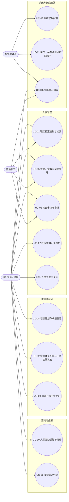

参与者与用例的对应关系如下：

| 参与者         | 职责范围                                   | 可访问用例                                           |
| -------------- | ------------------------------------------ | ---------------------------------------------------- |
| 系统管理员     | 全部功能，含系统设置与用户管理             | UC-01 ~ UC-13                                        |
| HR 专员 / 经理 | 人事、薪酬、培训、报表的操作；系统设置只读 | UC-01、UC-02、UC-05 ~ UC-11、UC-13、UC-04            |
| 普通职工       | 自助：查本人档案与工资、提交请假、智能问答 | UC-01（限本人）、UC-04、UC-05（发起）、UC-06（申请） |

用例与功能需求的追溯关系如下（**13 个用例完整覆盖 19 条功能需求**）：

| 用例编号 | 用例名称                   | 主要参与者                     | 对应功能需求                    |
| -------- | -------------------------- | ------------------------------ | ------------------------------- |
| UC-01    | 职工档案查询与检索         | 普通职工（限本人）、HR、管理员 | FR-PER-01、FR-QRY-01            |
| UC-02    | 薪酬体系配置与工资核算发放 | HR、管理员                     | FR-SAL-01、FR-SAL-02            |
| UC-03    | 系统权限配置               | 管理员                         | FR-SYS-01                       |
| UC-04    | AI 机器人问答              | 全部角色                       | FR-AI-01、FR-AI-02              |
| UC-05    | 考勤、请假与奖罚管理       | 普通职工（发起）、HR、管理员   | FR-PER-03                       |
| UC-06    | 转正申请与审批             | 普通职工（申请）、HR、管理员   | FR-PER-02                       |
| UC-07    | 社保缴纳记录维护           | HR、管理员                     | FR-PER-02                       |
| UC-08    | 培训计划与成绩登记         | HR、管理员                     | FR-TRN-01、FR-TRN-02            |
| UC-09    | 加班与水电费登记           | HR、管理员                     | FR-SAL-03                       |
| UC-10    | 人事变动通知单打印         | HR、管理员                     | FR-QRY-02                       |
| UC-11    | 报表统计分析               | HR、管理员                     | FR-RPT-01、FR-RPT-02、FR-RPT-03 |
| UC-12    | 用户、菜单与基础数据管理   | 管理员                         | FR-SYS-02、FR-SYS-03            |
| UC-13    | 员工生日关怀               | HR、管理员                     | FR-PER-04                       |

> **编号说明**：UC-01 ~ UC-05 沿用初版编号与语义（UC-01、UC-02、UC-05 的名称做了扩展，
> 以覆盖原设计遗漏的功能条目），UC-06 ~ UC-13 为本次新增。
> 用例编号与代码中的注释保持一一对应，便于双向追溯。
> 其中 UC-05 对应原活动图所描述的「请假申请与审批」流程，与图 6-10 完全对应。

### 6.3 类图（图 6-2 ~ 图 6-5）

系统共有 **24 个业务实体类**，均已在 `hrms/apps/*/models.py` 中实现。
按 app 划分成四个域分别建模——全部塞进一张图会看不清，
而按域分开还能顺带产出包图（图 6-6）。

类名与属性名**与 `models.py` 逐字一致**（均为英文），这样工具导出的 Python 框架
才能与现有代码对照；每个类只列出 5~8 个关键属性，不列 `created_at` 等审计字段。

#### 6.3.1 核心域 —— 组织机构与员工（图 6-2）

对应 `apps.sysconf`（FR-SYS-01、FR-SYS-02、FR-SYS-03、FR-PER-01）。

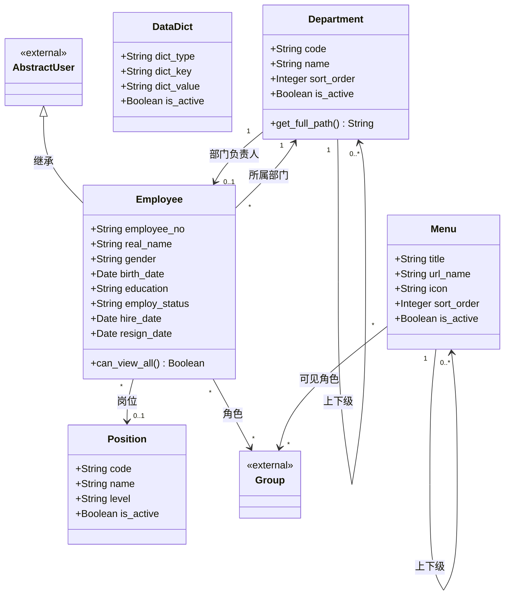

设计要点：

* **工号即账号**：`Employee.save()` 始终以 `employee_no` 覆盖 `username`，
  改工号后账号自动跟随，不会出现「改完工号登不进去」。
* **`can_view_all()`** 是行级数据范围的判定入口（对应图 6-9）。
* `Department.parent` 用 `on_delete=PROTECT`：部门下若有子部门或员工则禁止删除，
  避免产生游离数据。

#### 6.3.2 人事域（图 6-3）

对应 `apps.personnel`（FR-PER-01、FR-PER-02、FR-PER-03）。

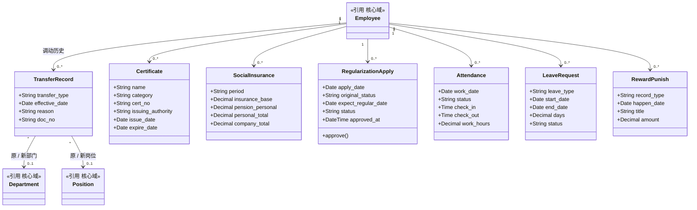

设计要点：

* **调动记录前后值成对保存**（`before_*` / `after_*`）而非只存新值，
  查看历史时无需倒推，也不怕后续档案被修改。
* `SocialInsurance.personal_total` 是工资公式中「社保自负部分」的数据来源；
  `RewardPunish.amount` 是「奖罚净额」的来源——两个类都参与了 FR-SAL-02 的计算。
* 请假审批通过后会写入多条 `Attendance`（对应图 6-8 的一对多写入）。

#### 6.3.3 薪酬域（图 6-4）

对应 `apps.salary`（FR-SAL-01、FR-SAL-02、FR-SAL-03）。

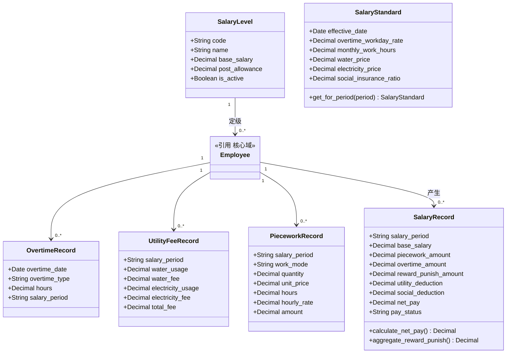

设计要点：

* **`SalaryStandard` 按 `effective_date` 版本化**：核算某月工资时取「生效日期不晚于该月」
  的最新一条。若只存一行直接覆盖，**历史工资就再也算不出来了**。
* `SalaryRecord` 是**核算结果的快照**：各金额字段在核算时一次算好落库，
  不随标准调整而变动（工资条是财务凭证）。
* `calculate_net_pay()` 对应 SRS 4.3 的公式；`pay_status` 是图 6-14 状态机的状态字段。
* `SalaryStandard` 是全局配置，不直接挂在 `Employee` 上，因此图中无外键连线。

#### 6.3.4 支撑域 —— 培训 / 通知 / 智能助手（图 6-5）

对应 `apps.training`、`apps.pubquery`、`apps.assistant`
（FR-TRN-01/02、FR-QRY-02、FR-AI-01/02）。

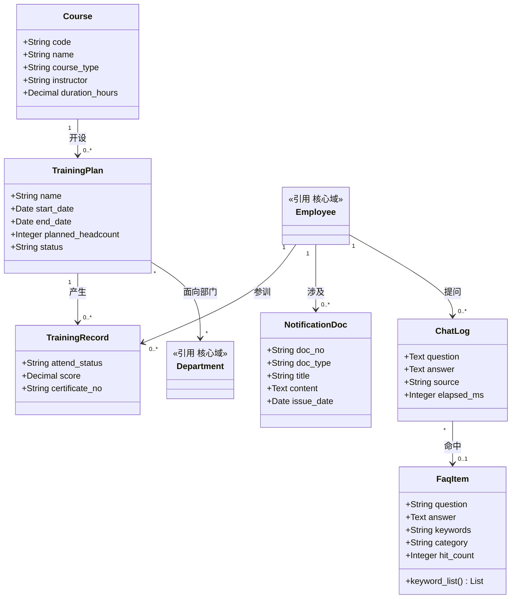

设计要点：

* **课程与计划分表**：课程是可复用的知识资产（一门课可办多期），
  计划是一次具体的办班活动；成绩挂在计划上而非课程上，
  才能区分「同一门课不同期」。
* `ChatLog.source` 记录应答来源（`rules` / `template` / `cloud` / `fallback`），
  既能统计各应答路径占比，也便于排查「这次为何答得不对」。
* `NotificationDoc` 「套红」效果由模板呈现，本表只存正文数据。

### 6.4 包图（图 6-6）

描述七个业务 app 的划分与依赖方向。依赖箭头统一指向 `apps.sysconf`（核心域）。

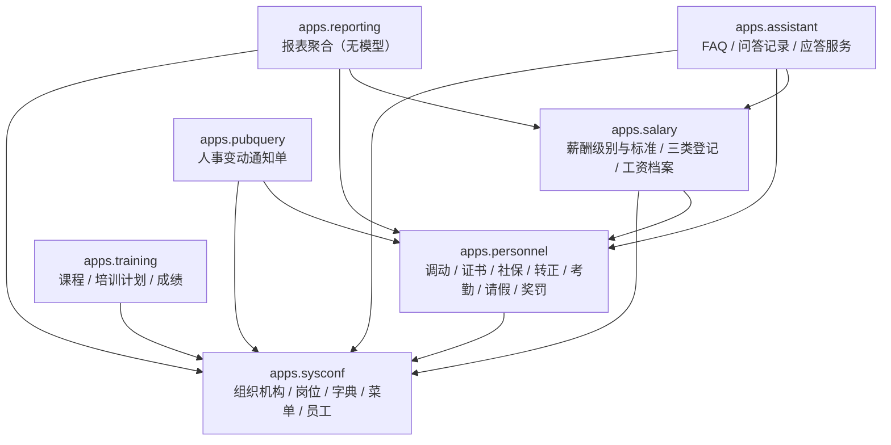

设计要点：

* `apps.reporting` 是**唯一没有数据模型**的 app——它只做跨模块聚合查询，
  因此类图（图 6-2 ~ 图 6-5）中没有 reporting 的类，这一点在评图时容易被追问。
* `apps.salary` 依赖 `apps.personnel`，是因为工资公式需要奖罚、社保与考勤数据；
  这一依赖在类图上表现为图 6-4 中的「引用 核心域」与公式数据来源。

### 6.5 时序图（图 6-7 ~ 图 6-9）

三张时序图分别覆盖三个不同的技术点：**事务边界**、**跨模块写入**、**行级数据范围**。
生命线一律使用**真实类名**（而非「前端 / 服务 / 数据库」这类泛化角色），
以便与类图（图 6-2 ~ 图 6-5）逐一对上。

#### 6.5.1 工资核算与发放（图 6-7）

对应 UC-02（FR-SAL-01、FR-SAL-02）。重点刻画两个在代码中真实存在的分支：
**事务回滚**（任一条失败则整批不落库）与**已发放锁定**（`paid` 记录跳过重算）。

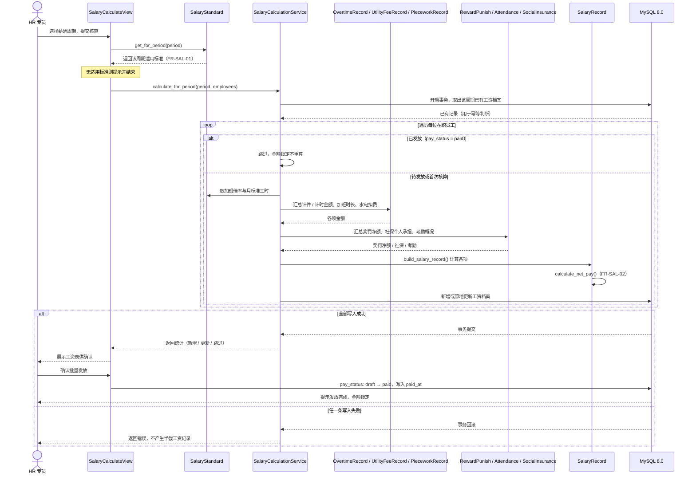

#### 6.5.2 请假申请与审批（图 6-8）

对应 UC-05（FR-PER-03）。本图的价值在于刻画**本系统唯一一处跨模块写操作**：
审批通过后在**同一事务内**按日循环写入考勤，形成「一次审批 → 多条考勤」的一对多写入。

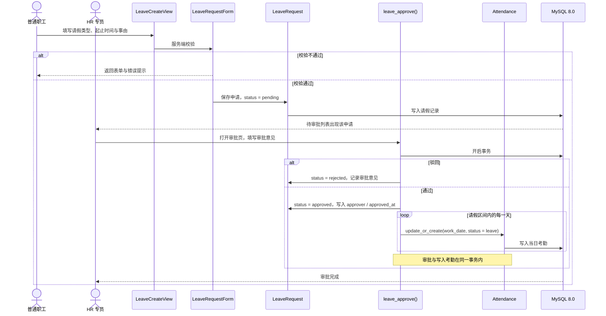

#### 6.5.3 职工档案查询与行级数据范围控制（图 6-9）

对应 UC-01（FR-PER-01、FR-QRY-01）。刻画**模型级权限 + 行级数据范围**两层过滤。

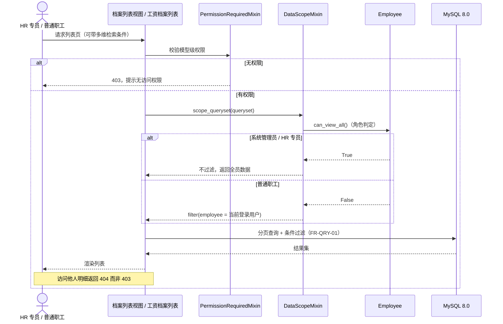

设计要点：Django 的权限是**模型级**的，只能表达「能否访问请假模型」，
无法表达「普通职工只能看自己的请假」。行级规则因此在视图层实现，
抽为 `DataScopeMixin` 供人事与薪酬模块共用。

### 6.6 活动图（图 6-10 ~ 图 6-12）

#### 6.6.1 请假申请与审批流程（图 6-10）

对应 UC-05（FR-PER-03）。与图 6-8 互补：时序图看**调用链**，活动图看**审批分支**。

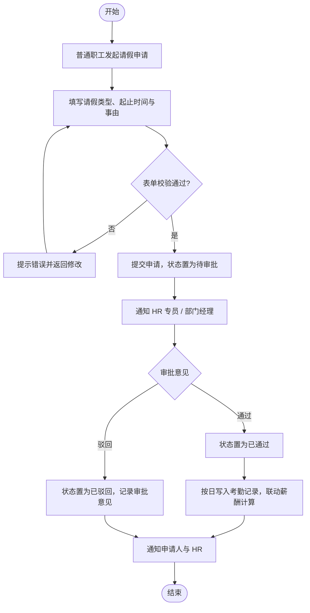

#### 6.6.2 转正申请与审批流程（图 6-11）

对应 UC-06（FR-PER-02）。关键在最后一步：
**审批通过后系统自动修改员工档案状态**，因此转正结果不需要人工二次修改。

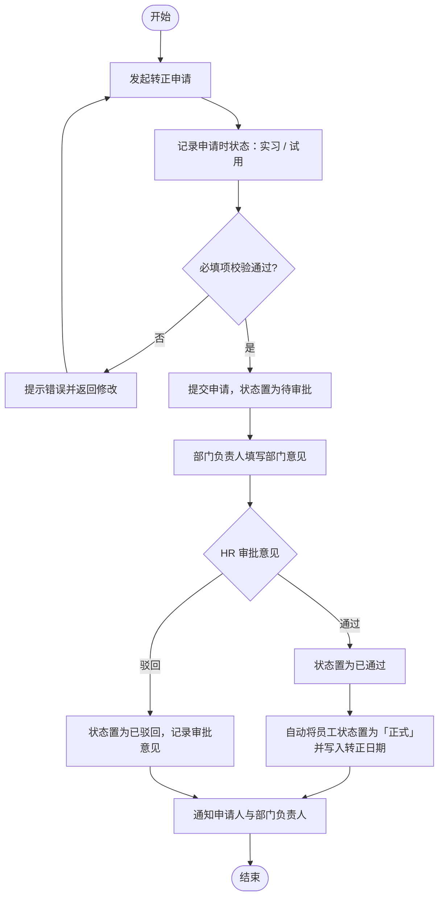

#### 6.6.3 智能问答三级降级判定（图 6-12）

对应 UC-04（FR-AI-01、FR-AI-02）。判定顺序与代码实现完全一致，
**个人数据一律查库回答、不经过大模型**是本模块最重要的设计取舍。

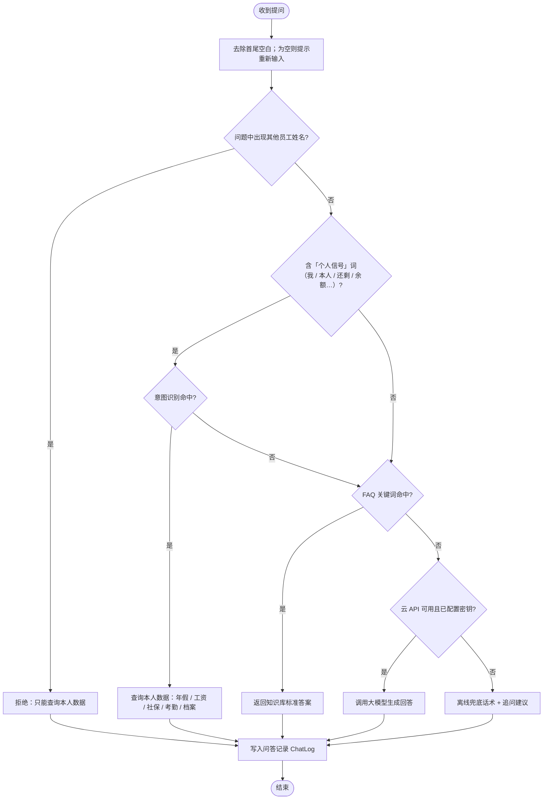

设计要点：

* 「个人信号」闸门不可省：「年假有多少天」（制度问题）与「我还有几天年假」（个人数据）
  共享核心词「年假」，少了这道闸，制度问题会被拿去查个人数据，答非所问。
* 越权提问先于一切匹配判定：「张伟的年假还剩几天」同样会命中「年假」意图，
  若先做意图匹配，就会用提问者自己的数据去回答一个关于别人的问题。

### 6.7 状态图（图 6-13 ~ 图 6-14）

补充课程四图之外的状态图，用于刻画系统内两处真实存在的状态机。

#### 6.7.1 员工在职状态（图 6-13）

对应 UC-06、UC-07（FR-PER-02）。选择该状态机而非请假审批，
是因为请假已由活动图（图 6-10）覆盖，而员工状态跨档案、转正审批、薪酬核算、
报表口径四个模块，信息量更大。

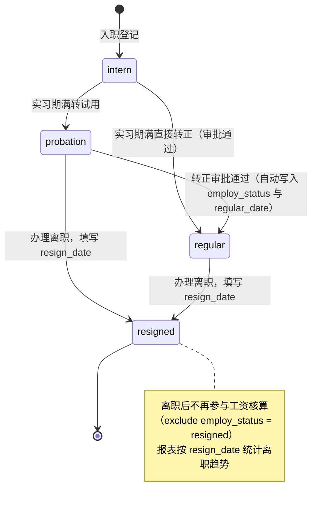

设计要点：离职状态有两处联动——薪酬核算会排除离职员工；
报表按 `resign_date` 统计离职趋势，而**不是**按 `is_deleted`，
因为 `is_deleted` 同时覆盖「误录入作废」，两者语义不同。

#### 6.7.2 工资档案发放状态（图 6-14）

对应 UC-02（FR-SAL-02）。只有两个状态，但带有真实的业务约束。

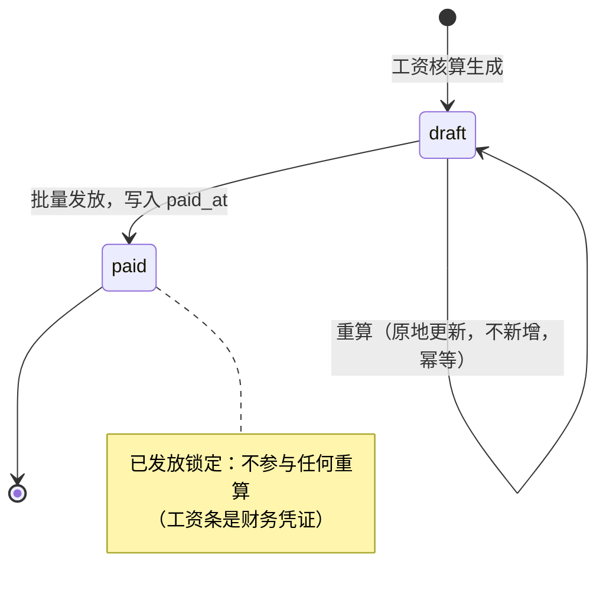

### 6.8 部署图（图 6-15）

课程约束明确要求「**不能做成单机版**，须为网络版（B/S 或 C/S）」，
因此单独出部署图作为该约束的书面实证。

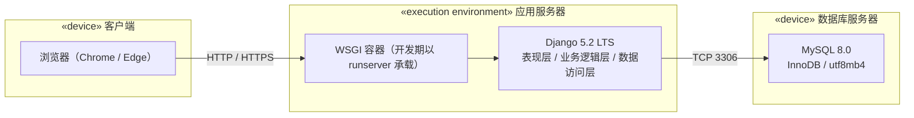

设计要点：

* 客户端无需安装任何程序，属标准 **B/S 架构**；
* 数据库与应用进程**分离部署**，可被多个客户端并发访问；
* 开发期以 `runserver` 承载 WSGI 角色；生产环境可将 WSGI 容器替换为 gunicorn 并前置 Nginx，
  应用代码无需修改——这也是采用 WSGI 标准接口的收益。

### 6.9 建模工具与代码导出

#### 6.9.1 工具与产物

| 项目     | 说明                                                                |
| -------- | ------------------------------------------------------------------- |
| 建模工具 | Visual Paradigm Community Edition                                   |
| 建模产物 | `HRMS/uml/HRMS.vpp`（工程文件入库，接受检查）                     |
| 图纸导出 | `HRMS/uml/images/6-1 … 6-15`（PNG，按图号命名）                  |
| 代码导出 | `HRMS/uml/generated/`（**Python Entity & Interface** 框架） |

导出流程：在 Visual Paradigm 中完成建模后，通过 **Tools ▸ Code Engineering ▸ Generate Code**
选择 Python，导出语言为 **Entity & Interface**，即：

* **Entity**：图 6-2 ~ 图 6-5 中的 **24 个类**，导出为带属性与业务方法的 Python 类骨架；
* **Interface**：从系统服务层抽取的 **4 个接口**（如下表），导出为 Python 抽象类/协议声明。

#### 6.9.2 导出的接口（Interface）清单

| 接口名                | 实现位置（现有代码）           | 主要方法                                                                                                                               |
| --------------------- | ------------------------------ | -------------------------------------------------------------------------------------------------------------------------------------- |
| `ISalaryService`    | `apps/salary/services.py`    | `calculate_for_period`、`build_salary_record`、`calculate_overtime_amount`、`resolve_social_deduction`、`attendance_summary` |
| `IReportService`    | `apps/reporting/services.py` | `gender_distribution`、`age_distribution`、`education_distribution`、`tenure_distribution`、`flow_series`、`flow_summary`  |
| `IAssistantService` | `apps/assistant/services.py` | `answer_question`、`match_intent`、`match_faq`、`ask_cloud`、`annual_leave_quota`、`annual_leave_used`                     |
| `IAuthService`      | `apps/sysconf/scoping.py`    | `can_view_all`、`scope_queryset`、`department_and_children_ids`                                                                  |

> 接口之所以从服务层而非模型层抽取：公式、报表口径、降级规则都属于**业务规则**，
> 它们已经集中在各 app 的 `services.py` 中，抽取接口后与现有代码一一对应，不产生第二套实现。

#### 6.9.3 导出代码与现有 `models.py` 的关系

导出的 Python 框架**与现有 `models.py` 并存**，不替代后者：

* 现有 `models.py` 是**运行实现**（已通过 143 项验证、跑在整个系统上），不可改动；
* 导出的框架是**模型到代码的映射产物**，用于证明「模型可生成代码框架」，并作为
  模型完整性的复核依据；
* 若两者不一致，**以 `models.py` 为准**并修正模型，不反向修改已跑通的代码。

#### 6.9.4 类 ↔ 数据表对照

24 个实体类全部映射到数据库表，且与 SRS 5.2 的「28 张表」口径一致：

| 项目                 | 数量         | 说明                                                                                                                                                                                  |
| -------------------- | ------------ | ------------------------------------------------------------------------------------------------------------------------------------------------------------------------------------- |
| 业务实体表           | 24           | 对应图 6-2 ~ 图 6-5 的 24 个类（Django 表名`app_类名小写`）                                                                                                                         |
| 多对多关联表         | 4            | `sysconf_employee_groups`、`sysconf_employee_user_permissions`、`sysconf_menu_visible_roles`、`training_trainingplan_target_departments`；在类图上表现为关联关系，不单独画类  |
| **业务表合计** | **28** | 与 5.2 节「共 28 张表」完全对应                                                                                                                                                       |
| 框架内置表           | 7            | `auth_group`、`auth_group_permissions`、`auth_permission`、`django_admin_log`、`django_content_type`、`django_migrations`、`django_session`；由 Django 自带，不纳入类图 |

完整的「类名 → 源文件 → 数据表名」逐条对照表见 `HRMS/uml/README.md` 第 10 节，
同时收入综合实践报告的「详细设计」一节。

---

## 7. 非功能需求 (Non-Functional Requirements)

### 7.1 性能与并发

1. **响应时间（设计目标）**：在本机单机部署、数据量 $\le$ 1 万条的条件下，常规查询操作响应时间 $\le 1.5\text{s}$；复杂报表导出响应时间 $\le 3\text{s}$。
2. **多用户访问**：支持多用户同时在线，满足小型企业日常考勤与查询使用。
3. **测量方法**：指标定义、取样规则、记录表与通过标准详见《HRMS 系统测试预案》第 3 章。

### 7.2 界面与易用性

1. **Web 响应式界面**：主次清晰，菜单支持根据用户角色动态加载。
2. **导航与提示**：具备数据录入校验机制（如身份证号、手机号格式校验），错误提示友好。

### 7.3 安全与合规

1. **认证与授权**：基于 RBAC 的访问控制（见 FR-SYS-01），未登录用户不得访问业务功能。
2. **数据存储**：数据存放于本地 MySQL 数据库，账号密码经哈希存储，符合数据安全与隐私保护要求。
3. **数据一致性**：关键业务事务化处理（见 5.3）。

---

## 8. 需求追溯与验收 (Traceability & Acceptance)

### 8.1 需求追溯矩阵

| 需求模块       | 功能需求              | 对应用例      | 交付物           | 课程验收要点                                                                                                                                              |
| -------------- | --------------------- | ------------- | ---------------- | --------------------------------------------------------------------------------------------------------------------------------------------------------- |
| 人事管理       | FR-PER-01 ~ FR-PER-04 | UC-01         | D-01、D-05       | 覆盖 100%（37 项）；10 月 15 日验收                                                                                                                       |
| 培训管理       | FR-TRN-01 ~ FR-TRN-02 | UC-08         | D-01、D-05       | 覆盖 100%（37 项）                                                                                                                                        |
| 薪酬管理       | FR-SAL-01 ~ FR-SAL-03 | UC-02         | D-01、D-03、D-05 | 加班/水电费登记完整，事务保证 ACID 一致性                                                                                                                 |
| 公共查询       | FR-QRY-01 ~ FR-QRY-02 | UC-01、UC-10  | D-01             | —                                                                                                                                                        |
| 报表统计       | FR-RPT-01 ~ FR-RPT-03 | UC-11         | D-01、D-05       | —                                                                                                                                                        |
| 系统设置与安全 | FR-SYS-01 ~ FR-SYS-03 | UC-03         | D-01、D-03       | RBAC 权限模型                                                                                                                                             |
| AI 应答机器人  | FR-AI-01 ~ FR-AI-02   | UC-04         | D-04             | 加分项                                                                                                                                                    |
| UML 建模       | 见第 6 章             | UC-01 ~ UC-13 | D-02             | 用例图 / 类图 ×4 / 包图 / 时序图 ×3 / 活动图 ×3 / 状态图 ×2 / 部署图，共 15 张；用例覆盖 UC-01 ~ UC-13；由模型生成 Python Entity & Interface 代码框架 |

### 8.2 交付物清单 (Deliverables Checklist)

根据课程考核要求，本次开发成果验收对比如下：

| 交付编号 | 交付物名称         | 规格标准                                                                                                                                                   | 课程要求对应项        |
| -------- | ------------------ | ---------------------------------------------------------------------------------------------------------------------------------------------------------- | --------------------- |
| D-01     | 软件系统源码       | 覆盖 100%（37 项）需求，支持网络访问（非单机）                                                                                                             | 验收时间：10 月 15 日 |
| D-02     | UML 模型与代码     | 提供 15 张 UML 图（用例图、类图 ×4、包图、时序图 ×3、活动图 ×3、状态图 ×2、部署图），用例覆盖 UC-01 ~ UC-13，并导出 Python Entity & Interface 代码框架 | 教授要点第 4 项       |
| D-03     | MySQL 8.0 SQL 脚本 | 包含 DDL 表结构建表语句与测试数据 DML                                                                                                                      | 数据库要求            |
| D-04     | AI 应答模块        | 具备文本交互功能，支持离线规则模式与云 API 增强                                                                                                            | 加分项                |
| D-05     | 综合实践报告       | 个人撰写，包含 10 项完整结构及测试结果                                                                                                                     | 占总评 35%            |
| D-06     | 系统测试预案与记录 | 性能指标定义、≥45 条测试用例、缺陷记录与结果汇总                                                                                                          | 报告第 7 章测试与部署 |

---

## 附录 A 修订记录

| 版本 | 日期       | 修订内容                                                                                                                                                                                                                                                                                                                                                                                                                                                                   | 修订人 |
| ---- | ---------- | -------------------------------------------------------------------------------------------------------------------------------------------------------------------------------------------------------------------------------------------------------------------------------------------------------------------------------------------------------------------------------------------------------------------------------------------------------------------------- | ------ |
| V1.1 | 2026-09-28 | 按软件工程规范重构章节结构；补充术语表、运行环境、约束与假设、数据需求、需求追溯矩阵；补充时序图（工资计算与发放）与活动图（请假审批）；明确优先级判定原则为「核心业务为高」；补齐 UC-05 使用例图与活动图闭环；技术栈定为 Django 5.2 LTS + MySQL 8.0（Django 6.x 要求 MySQL 8.4+，本机 MySQL 8.0.19 故选用 5.2 LTS）；功能需求由 16 项扩充至 19 项以覆盖课程清单全部 37 项；修正类图基数（User-Role 多对多、Employee-Department 多对 1）；性能指标明确为设计目标；统一署名 | 王坤尧 |
| V1.2 | 2026-09-28 | 工资核算公式增加「奖罚净额」项，使 FR-PER-03 登记的奖励与处罚参与实发工资计算；补充各项数据来源与计算口径说明；补充工资核算幂等性与发放锁定规则；同步修订时序图与测试预案                                                                                                                                                                                                                                                                                                  | 王坤尧 |
| V1.3 | 2026-10-01 | 完成系统 UML 建模设计：UML 图由 4 张扩充至 15 张（新增包图 1 张、时序图 2 张、活动图 2 张、状态图 2 张、部署图 1 张；用例补齐至 UC-01 ~ UC-13）；类图重构为核心域、人事域、薪酬域、支撑域四张，共 24 个类，类名与字段名与 models.py 逐字对齐；术语表补充 WSGI、ORM、HTTP、ECharts；补充 Entity & Interface 导出说明与类↔数据表对照（24 实体表 + 4 关联表 = 28 业务表）；需求追溯矩阵与交付物清单同步更新                                                                  | 王坤尧 |
